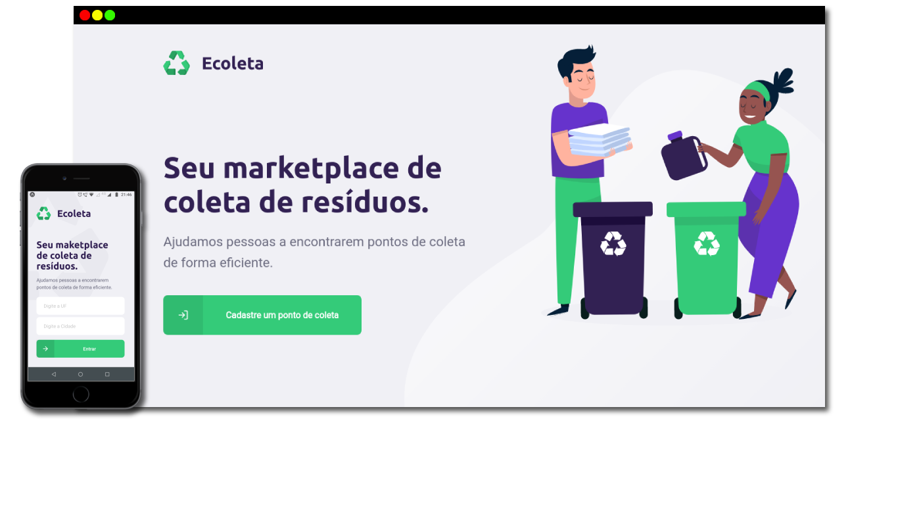
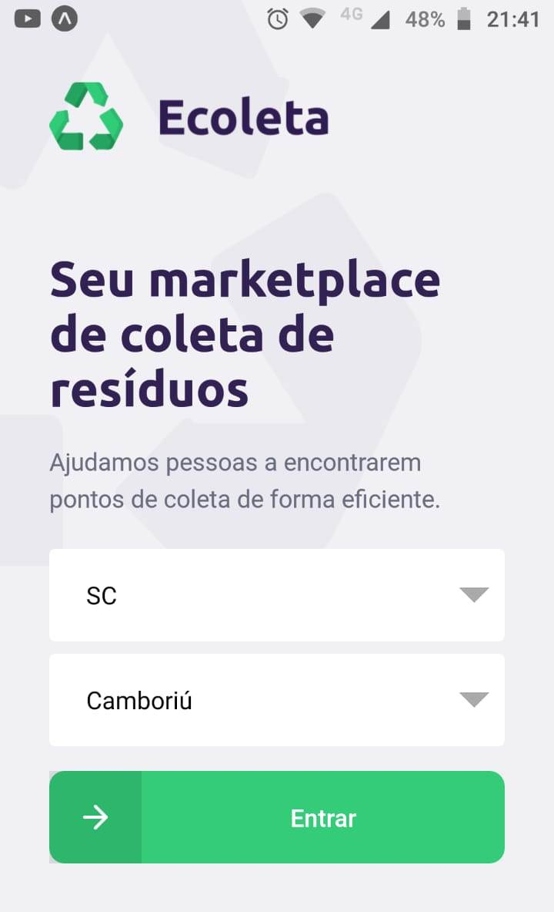
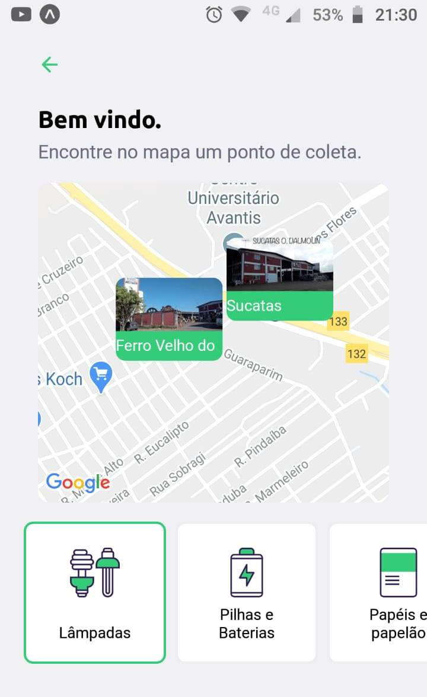
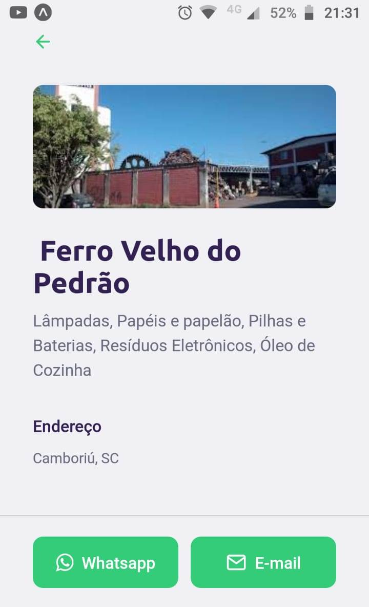

<h1 align="center">
    
</h1>

<h4 align="center"> 
	NextLevelWeek 1.0 - Rocketseat 🚀
</h4>

<p align="center">
  

  

  <a href="https://github.com/EdsonCandido73/Ecoleta/commits/master">
    
  </a>
  
  
</p>


## 💻 Sobre o projeto

♻️Ecoleta - é um projeto que ajuda pessoas a encontrarem pontos de coleta de resíduos de forma eficiente.

As empresas ou entidades poderão se cadastrar na plataforma web enviando:
- uma imagem do ponto de coleta
- nome da entidade, email e whatsapp
- e o endereço para que ele possa aparecer no mapa
- além de selecionar um ou mais ítens de coleta: 
  - lâmpadas
  - pilhas e baterias
  - papéis e papelão
  - resíduos eletrônicos
  - resíduos orgânicos
  - óleo de cozinha

Os usuários terão acesso ao aplicativo móvel, onde poderão:
- navegar pelo mapa para ver as instituições cadastradas
- entrar em contato com a entidade através do E-mail ou do WhatsApp

Projeto desenvolvido durante a # NLW - Next Level Week 1 # oferecida pela [Rocketseat] / Diego Fernandes.
O NLW é uma experiência online com muito conteúdo prático, onde o conteúdo fica disponível durante uma semana.


### Mobile

<p align="center">
  
  
  
</p>

### Web

<p align="center" style="display: flex; align-items: flex-start; justify-content: center;">
   
</p>

## 🛠 Tecnologias

As seguintes ferramentas foram usadas na construção do projeto:

- [TypeScript][typescript]
- [Node.js][nodejs]
- [React][reactjs]
- [React Native][rn]
- [Expo][expo]


## 🚀 Como rodar este projeto

Este projeto está divido em três partes:
1. Back-end (pasta server) 
2. Front-end (pasta web)
3. Mobile (pasta mobile)

💡Tanto o Front End quanto o Mobile precisam que o Back-end esteja sendo executado para funcionar.

### Pré-requisitos

Antes de começar, você vai precisar ter instalado em sua máquina as seguintes ferramentas:
[Git](https://git-scm.com), [Node.js][nodejs]. 
Além disto é bom ter um editor para trabalhar com o código como [VSCode][vscode]

### Rodando o Back End (servidor)

```bash
# Clone este repositório

# Acesse a pasta do projeto no terminal/cmd
$ cd Ecoleta

# Vá para a pasta server
$ cd server

# Instale as dependências
$ npm install

# Execute a aplicação em modo de desenvolvimento
$ npm run dev

# O servidor inciará na porta:3333 - acesse http://localhost:3333 
```

### 🧭 Rodando a aplicação web (Front End)

```bash
# Clone este repositório

# Acesse a pasta do projeto no seu terminal/cmd
$ cd Ecoleta

# Vá para a pasta da aplicação Front End
$ cd web

# Instale as dependências
$ npm install

# Execute a aplicação em modo de desenvolvimento
$ npm run start

# A aplicação será aberta na porta:3000 - acesse http://localhost:3000
```

### 📱Rodando a aplicação mobile 

```bash
# Clone este repositório

# Acesse a pasta do projeto no seu terminal/cmd
$ cd Ecoleta

# Vá para a pasta da aplicação Front End
$ cd mobile

# Instale as dependências
$ npm install

# Execute a aplicação em modo de desenvolvimento
$ expo start

## 📝 Licença

Este projeto esta sobe a licença MIT. Veja a [LICENÇA](license) para saber mais.

Feito por Edson Cândido

[nodejs]: https://nodejs.org/
[typescript]: https://www.typescriptlang.org/
[expo]: https://expo.io/
[reactjs]: https://reactjs.org
[rn]: https://facebook.github.io/react-native/
[yarn]: https://yarnpkg.com/
[vscode]: https://code.visualstudio.com/
[license]: https://opensource.org/licenses/MIT
[rs]: https://rocketseat.com.br